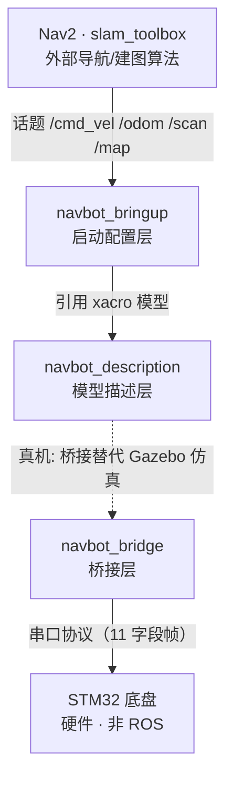

# navbot —— 两轮差速小车 ROS2 自主导航

基于 **ROS2 Humble + Nav2 + slam_toolbox** 的两轮差速小车自主导航项目。
仿真走 **Gazebo Classic 11**，真机走 **STM32 底盘 + 串口桥接**，同一套模型仿真真机复用。

> 📹 动图占位：录一段「slam_toolbox 建图 + Nav2 自主导航」的 10 秒 GIF 放这里。

---

## 系统架构



三个包职责单一、依赖单向：

| 包 | 层 | 职责 |
|---|---|---|
| `navbot_description` | 模型描述层 | 车长什么样（URDF/xacro） |
| `navbot_bringup` | 启动配置层 | 怎么把车跑起来（launch + config） |
| `navbot_bridge` | 桥接层（真机） | 串口 ↔ ROS 话题 |

完整架构说明见 [`docs/A4_三包架构说明.md`](docs/A4_三包架构说明.md)。

---

## 项目结构

```
.
├── src/                       # ROS2 工作空间源码
│   ├── navbot_description/    #   模型描述层（阶段 A）
│   ├── navbot_bringup/        #   启动配置层（阶段 B/C/D）
│   └── navbot_bridge/         #   桥接层（真机，阶段 D）
├── docs/                      # 文档
│   ├── 00_环境一键安装文档.md
│   ├── P3_...保姆级项目文档.md
│   ├── A3_URDF建模概念清单.md
│   ├── A3_URDF建模模板.md
│   └── A4_三包架构说明.md
├── 无硬件自测/                # 端到端验证脚本（假底盘 ↔ 串口 ↔ ROS）
├── firmware/                  # STM32 底盘固件（真机）
├── setup_env.sh               # 环境一键重建脚本
├── README.md
└── .gitignore
```

---

## 快速启动（仿真全流程）

```bash
# ① 环境重建（新机器 / 实例重置后，约 15~25 分钟，幂等可重复跑）
bash setup_env.sh

# ② 起仿真（无头环境加 gui:=false）
source /opt/ros/humble/setup.bash && source install/setup.bash
ros2 launch navbot_bringup sim_navbot.launch.py gui:=false

# ③ 建图（终端 2）
ros2 launch navbot_bringup slam_mapping.launch.py use_sim_time:=true

# ④ 遥控走一圈后存图（终端 3）
ros2 run nav2_map_server map_saver_cli -f navbot_room

# ⑤ 导航（关掉建图，加载地图 + AMCL + Nav2）
ros2 launch navbot_bringup nav_bringup.launch.py use_sim_time:=true
```

四个 launch 对应四个阶段的主线：

```
display_navbot（看模型）→ sim_navbot（动起来）→ slam_mapping（建图）→ nav_bringup（导航）
    阶段 A                  阶段 B                阶段 C               阶段 D
```

---

## 环境配置

环境依赖与踩坑全部沉淀在 [`setup_env.sh`](setup_env.sh)，一键重建。内置以下实战修复：

1. rosdep 双源国内镜像（index 走中科大、yaml 清单走清华）
2. python3 强制系统 3.10（容器默认 3.11 与 ROS Humble 冲突）
3. 激光 `gpu_ray → ray`（无头环境 GPU 渲染被禁）
4. 环境变量注入 `~/.bashrc` 顶部（绕开非交互提前 return）

详细说明见 [`docs/00_环境一键安装文档.md`](docs/00_环境一键安装文档.md)。

---

## 硬件 BOM（真机）

| 部件 | 型号 | 说明 |
|---|---|---|
| 主控 | STM32（待定型号） | 底盘控制，见 `firmware/` |
| 电机 ×2 | 带编码器减速电机 | PPR 2112 |
| 激光雷达 | RPLIDAR A1 | 单线 360°，驱动 `rplidar-ros` |
| 轮距 / 轮径 | 0.16 m / 0.0325 m | 与 `navbot.xacro` 和 `nav2_params.yaml` 三处一致 |

> 待补：接线图、引脚对应表。

---

## 踩坑记录（挑 3 个）

1. **`map → odom` 谁发布？** 建图时 slam_toolbox 发、导航时 AMCL 发，两个同时开会 TF 抖动。→ 建图和导航分两个 launch，二选一。
2. **`joint_state_publisher` 一直等 robot_description** —— 它是 Python 包，不能 `find_package`，且 launch 里要显式传 `robot_description` 参数。
3. **无头容器 `/scan` 空** —— `gpu_ray` 依赖 GPU 渲染，无头被禁，改用 CPU 的 `ray`。

更多见保姆级文档 §六 陷阱章节。

---

## 文档索引

| 文档 | 内容 |
|---|---|
| [P3 保姆级项目文档](docs/P3_ROS2自主导航移动机器人_保姆级项目文档.md) | 主线教程，阶段 A→D 全流程 |
| [00 环境一键安装](docs/00_环境一键安装文档.md) | 环境配置 + 踩坑 |
| [A4 三包架构说明](docs/A4_三包架构说明.md) | 系统架构 + 面试口述 |
| [A3 URDF 建模](docs/A3_URDF建模概念清单.md) | 建模概念与模板 |
