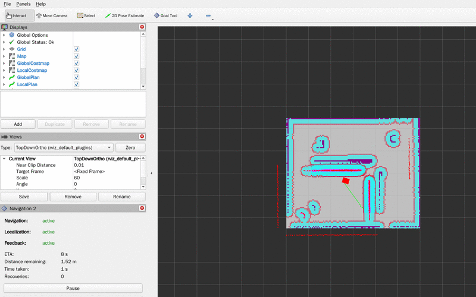

# navbot

基于 ROS2 Humble + Nav2 + slam_toolbox 的两轮差速小车导航项目。仿真跑 Gazebo Classic 11，真机接 STM32 底盘，URDF 模型两边复用。



> 车在 `navbot_room` 房间里沿方形路线走一圈，回到起点成环。
> 录制命令：`bash record_navigation.sh square`（无头环境，脚本用 Xvfb 起虚拟屏跑 RViz）。

## 目录

- [系统组成](#系统组成)
- [目录结构](#目录结构)
- [环境准备](#环境准备)
- [仿真流程](#仿真流程)
- [脚本](#脚本)
- [配置说明](#配置说明)
- [真机路线](#真机路线)
- [已知问题](#已知问题)
- [相关文档](#相关文档)

## 系统组成

三个包，依赖单向，没有循环：

| 包 | 职责 |
|---|---|
| `navbot_description` | URDF/xacro 模型，关节树、惯量、雷达支架 |
| `navbot_bringup` | launch 文件、Nav2 与 slam_toolbox 参数、Gazebo 世界、地图 |
| `navbot_bridge` | 串口 ↔ ROS 话题桥接（真机，暂未实现） |

导航部分直接用 Nav2 官方 `bringup_launch.py`，自己只提供参数文件和地图。

底盘参数在三个地方必须保持一致，改一个要同步另两个：

- 轮距 0.16 m、轮半径 0.0325 m —— `navbot.xacro`
- `robot_radius: 0.20` —— `nav2_params.yaml` 代价地图
- `--wheel-sep` / `--wheel-radius` —— `fake_chassis.py`

## 目录结构

```
.
├── src/                            ROS2 工作空间
│   ├── navbot_description/         模型
│   │   ├── urdf/
│   │   │   ├── navbot.xacro           机器人本体（主文件，被下面两个引用）
│   │   │   ├── navbot.urdf.xacro      引用本体
│   │   │   └── navbot.gazebo.xacro    Gazebo 插件：雷达、底盘、差速器
│   │   ├── launch/display_navbot.launch.py
│   │   └── rviz/navbot_check.rviz
│   ├── navbot_bringup/            启动与配置
│   │   ├── launch/
│   │   │   ├── sim_navbot.launch.py     只起仿真，不含 Nav2
│   │   │   ├── slam_mapping.launch.py   建图
│   │   │   └── nav_bringup.launch.py    定位 + 导航
│   │   ├── config/
│   │   │   ├── nav2_params.yaml
│   │   │   └── slam_toolbox_params.yaml
│   │   ├── maps/navbot_room.{pgm,yaml}  地图（pgm 由 map_saver 生成）
│   │   ├── worlds/navbot_room.world     Gazebo 世界
│   │   └── rviz/navbot_{nav,slam}.rviz
│   └── navbot_bridge/             串口桥接（待实现，仅有包骨架）
├── firmware/                      真机
│   ├── navbot_chassis.c           STM32 底盘固件
│   └── navbot_protocol.md         通信协议 v1（改代码前先看这份）
├── 无硬件自测/                     不接硬件也能验串口链路
│   ├── fake_chassis.py            假底盘，可注入四类故障
│   ├── test_protocol.py
│   └── verify_e2e.sh              端到端验证
├── docs/
│   ├── navigation_demo.gif        README 里的演示动图
│   ├── 00_环境一键安装文档.md
│   ├── A3_URDF建模概念清单.md
│   ├── A3_URDF建模模板.md
│   ├── A4_三包架构说明.md
│   ├── A5_知识概念全解.md
│   ├── G1_Git推送到GitHub详细步骤.md
│   └── P3_ROS2自主导航移动机器人_保姆级项目文档.md
├── setup_env.sh                   环境一键重建
├── check_env.sh                   环境体检
├── check_sim.sh                   仿真层四道门体检
├── record_navigation.sh           无头环境录导航 GIF
├── diag_ros_apt_key.sh            apt 源与密钥专项诊断
├── audit_scripts.sh               脚本自审
└── README.md
```

脚本的用途见[脚本](#脚本)一节。

## 环境准备

Ubuntu 22.04 + ROS2 Humble。一条命令重建环境层（装包、配国内源、编译工作空间），15~25 分钟，幂等可重复跑：

```bash
cd /mnt/workspace
bash setup_env.sh
```

装完先体检一次：

```bash
bash check_env.sh
```

实例重置后环境层会丢，`/mnt/workspace` 是持久 NAS 所以源码不受影响，重跑 `setup_env.sh` 即可。

装出来的包数应该是 211（按需安装，不是 desktop 全套，不必追求 300+）。

## 仿真流程

四个阶段各对应一个 launch，前进顺序是固定的。

### ① 看模型

```bash
source ~/.ros_env
ros2 launch navbot_description display_navbot.launch.py
```

### ② 让车动起来

```bash
ros2 launch navbot_bringup sim_navbot.launch.py gui:=false
```

无头环境加 `gui:=false`。另开终端遥控：

```bash
ros2 run teleop_twist_keyboard teleop_twist_keyboard
ros2 topic hz /scan    # 约 10 Hz
ros2 topic hz /odom    # 约 50 Hz
```

`/odom` 的 `frame_id` 应该是 `odom`，`child_frame_id` 是 `base_footprint`。

### ③ 建图

```bash
ros2 launch navbot_bringup slam_mapping.launch.py use_sim_time:=true
```

遥控车走一圈覆盖房间，确认 `/map` 有数据后存图：

```bash
ros2 topic hz /map      # 约 0.2 Hz，确认有帧再存
ros2 run nav2_map_server map_saver_cli -f navbot_room
```

存出来的 `.pgm` 和 `.yaml` 放进 `src/navbot_bringup/maps/`。

### ④ 导航

```bash
ros2 launch navbot_bringup nav_bringup.launch.py use_sim_time:=true
```

RViz 里先点 **2D Pose Estimate** 给初始位姿，再点 **Nav2 Goal** 发目标点。不依赖 RViz 的话：

```bash
ros2 action send_goal /navigate_to_pose nav2_msgs/action/NavigateToPose \
  "{pose: {header: {frame_id: map}, pose: {position: {x: 1.5, y: 1.0, z: 0.0}, orientation: {w: 1.0}}}}"
```

导航模式和建图模式互斥，两者同时跑会争抢 `map → odom`，表现为 TF 抖动、位置乱跳。

### 无头环境录 GIF

需要图形界面但没有显示器时，用虚拟屏跑 RViz 再截图合成：

```bash
bash record_navigation.sh square    # 走方形路线成环，输出 navigation.gif
```
Gazebo 跟不上真实时间（RTF < 1），车按仿真时间走而截图按真实时间拍，整段导航在墙上要花几分钟。脚本用「跑完为止」模式而非固定帧数。

## 脚本

| 脚本 | 用途 |
|---|---|
| `setup_env.sh` | 环境一键重建（装包、配源、编译） |
| `check_env.sh` | 3 秒体检，输出缺什么和对应命令；`--fix` 自动补 |
| `check_sim.sh` | 仿真层四道门体检（spawn / 话题 / TF）；`--diag` 只读快照 |
| `record_navigation.sh` | 无头环境录导航 GIF；`--diag` 现场诊断 |
| `diag_ros_apt_key.sh` | apt 源与 GPG 密钥专项诊断 |
| `audit_scripts.sh` | 脚本自审，抓 `bash -n` 查不到的错 |
| `无硬件自测/verify_e2e.sh` | 串口协议端到端验证（假底盘） |

改完 shell 脚本建议跑一次 `audit_scripts.sh`。它检查两类 `bash -n` 查不出的问题：命令名与引号之间缺空格（语法合法、运行时才炸），以及管道退出码被 `tee`/`sed` 吞掉导致错误分支永不触发。

## 配置说明

### launch 参数

| launch | 参数 | 默认 | 说明 |
|---|---|---|---|
| `sim_navbot` | `gui` | `true` | 无头环境设 `false` |
| | `use_sim_time` | `true` | 仿真必须 true |
| | `world` | `navbot_room.world` | Gazebo 世界 |
| `slam_mapping` | `use_sim_time` | `true` | |
| | `use_rviz` | `true` | |
| | `slam_params_file` | `slam_toolbox_params.yaml` | |
| `nav_bringup` | `map` | `maps/navbot_room.yaml` | |
| | `params_file` | `config/nav2_params.yaml` | |
| | `use_sim_time` | `true` | 真机改 `false` |
| | `use_rviz` | `true` | |
| | `autostart` | `true` | 生命周期节点自动激活；调试时可设 `false` 手动逐个激活 |
| `display_navbot` | `use_sim_time` | `true` | |
| | `use_rviz` | `true` | |

### 关键配置项

`config/nav2_params.yaml`：

| 项 | 值 | 说明 |
|---|---|---|
| `robot_radius` | 0.20 | 代价地图机器人半径，要大于车体半对角 |
| `max_vel_x` | 0.22 | 差速车不倒车，`min_vel_x` 为 0 |
| `max_vel_theta` | 1.0 | 原地旋转角速度 |
| `xy_goal_tolerance` | 0.15 | 位置容差 |
| `scan_topic` | `scan` | 无 `/scan` 前缀，适配 Gazebo 的相对话题名 |

`config/slam_toolbox_params.yaml`：

| 项 | 值 | 说明 |
|---|---|---|
| `resolution` | 0.05 | 必须与地图 yaml 的 `resolution` 一致，否则地图被缩放、路径撞墙 |
| `odom_frame` / `base_frame` | `odom` / `base_footprint` | |
| `enable_interactive_mode` | `true` | 允许在 RViz 里手动拉回环 |

`maps/navbot_room.yaml` 的 `origin` 由 map_saver 自动填写，不要手改；`negate` 必须为 0，搞反了 Nav2 会把空地当障碍。

## 真机路线

`navbot_bridge` 目前是空壳，串口桥接待实现。已经定好的部分：

- 通信协议 v1 —— [`firmware/navbot_protocol.md`](firmware/navbot_protocol.md)，ASCII 明文，上行 50 Hz 11 字段，下行 20 Hz 4 字段
- 底盘固件 —— [`firmware/navbot_chassis.c`](firmware/navbot_chassis.c)
- 无硬件验证 —— `fake_chassis.py` 冒充 STM32，可以注入死机、乱码、seq 停滞、零点漂移四类故障

改协议前先看那份文档，两端字段必须同步。

## 已知问题

**Gazebo 版本**：Humble 对应 Gazebo Classic 11，包名 `gazebo`。不要装 `ros-humble-ros-gz`（那是新版的桥接包），URDF 里的 `<gazebo>` 标签会找不到插件。

**无头环境 `/scan` 空**：`gpu_ray` 依赖 GPU 渲染，无头环境被禁。`setup_env.sh` 会自动把 xacro 里的 `gpu_ray` 改成 `ray`。

**`joint_state_publisher` 挂起**：它是 ament_python 包，没有 Config.cmake，不能在 CMakeLists 里 `find_package`。launch 里要显式传 `robot_description` 参数。

**`tf2_echo` 属于 `tf2_ros`**：`ros2 run tf2_tools tf2_echo` 会报 No executable found，`tf2_tools` 里只有 `view_frames`。

**`ament_lint_auto` 缺包**：`ros2 pkg create` 生成的 CMakeLists 默认 `find_package(ament_lint_auto REQUIRED)`，而 colcon build 默认 `BUILD_TESTING=ON`，不装它编译必挂。

**`joint_state_publisher` 依赖降级**：它是运行时依赖，留在 `package.xml` 的 `<exec_depend>`，不要放进 `<depend>`。

## 相关文档

| 文档 | 内容 |
|---|---|
| [P3 保姆级项目文档](docs/P3_ROS2自主导航移动机器人_保姆级项目文档.md) | 主线教程，阶段 A→D |
| [A4 三包架构说明](docs/A4_三包架构说明.md) | 架构拆解 |
| [A3 URDF 建模概念清单](docs/A3_URDF建模概念清单.md) | 建模概念与惯量宏 |
| [00 环境一键安装](docs/00_环境一键安装文档.md) | 环境配置与踩坑 |
| [A5 知识概念全解](docs/A5_知识概念全解.md) | 概念答疑 |
| [G1 Git 推送步骤](docs/G1_Git推送到GitHub详细步骤.md) | 推到 GitHub |

环境层的问题基本都沉淀在 `setup_env.sh` 文件头和 `docs/00_环境一键安装文档.md` 的「常见坑」章节。
