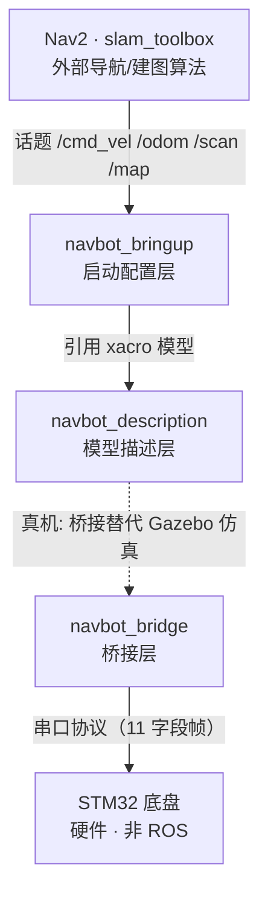

# A4 · 三包架构说明（navbot_description / bringup / bridge）

> **用途**：面试口述「系统架构」的素材（对应保姆级文档 §4.3 第 2 条），
> 以及日常开发时快速定位「改哪里、动哪个包」。
> **适用**：P3 ROS2 自主导航移动机器人项目。

---

## 一句话总览

三个包按 **「描述 → 启动 → 桥接」** 三层分工，职责单一、依赖单向：

- `navbot_description` —— 管**车长什么样**（模型）
- `navbot_bringup` —— 管**怎么把车跑起来**（启动 + 配置）
- `navbot_bridge` —— 管**真机时怎么和底盘通信**（串口桥接）

仿真走「描述 + 启动」两层；真机把 Gazebo 换成「桥接」层。

---

## 架构分层图



**读图顺序（自上而下 = 依赖方向，上层调用下层）**：

| 层级 | 包 | 一句话 |
|---|---|---|
| 外部算法 | Nav2 / slam_toolbox | 导航与建图算法，不属本项目 |
| 启动配置 | navbot_bringup | 编排：起哪些节点、用哪份参数 |
| 模型描述 | navbot_description | 车长什么样（URDF/xacro） |
| 桥接（真机） | navbot_bridge | 串口 ↔ ROS 话题 |
| 硬件 | STM32 底盘 | 固件，非 ROS |

---

## 逐文件清单

### ① navbot_description —— 模型描述层（阶段 A）

**职责**：只放描述，不放逻辑。改模型不动 launch，改参数不动模型。

| 文件 | 角色 | 具体职责 | 依赖 / 被谁调用 |
|---|---|---|---|
| `urdf/navbot.xacro` | 模型主体 | 7 个 link/joint + 4 个惯性宏（box/cyl/sphere/wheel/caster） | 被 `navbot.urdf.xacro` include |
| `urdf/navbot.urdf.xacro` | 总装入口 | 只做两行 include，拼「模型 + 仿真挂载」，不含几何 | 被 display_navbot / sim_navbot 用 xacro 展开 |
| `urdf/navbot.gazebo.xacro` | 仿真挂载层 | 3 插件：diff_drive、joint_state_publisher、ray 激光 | 被 urdf.xacro include；真机不加载 |
| `launch/display_navbot.launch.py` | 看模型 | 起 robot_state_publisher + joint_state_publisher + rviz | 依赖 rsp / jsp / rviz2 |
| `rviz/navbot_check.rviz` | 检查视图 | Fixed Frame = base_footprint | 被 display_navbot 加载 |
| `CMakeLists.txt` | 编译+安装 | install launch/urdf/rviz 到 share | — |
| `package.xml` | 依赖声明 | depend urdf/xacro；exec_depend rsp/jsp | — |

### ② navbot_bringup —— 启动配置层（阶段 B/C/D）

**职责**：只编排，不含模型和算法。起哪些节点、用哪份参数、加载哪个世界/地图。

| 文件 | 角色 | 具体职责 | 依赖 / 被谁调用 |
|---|---|---|---|
| `launch/sim_navbot.launch.py` | 起仿真（B） | 起 Gazebo + spawn 车 | 引用 description 的 urdf.xacro + worlds；依赖 gazebo_ros |
| `launch/slam_mapping.launch.py` | 建图（C） | 包一层 slam_toolbox online_async | 引用 config + rviz；依赖 slam_toolbox |
| `launch/nav_bringup.launch.py` | 导航（D，主 launch） | 包一层 Nav2 bringup_launch.py | 引用 config + maps + rviz；依赖 nav2_bringup |
| `config/slam_toolbox_params.yaml` | 建图参数 | 47 键，resolution 须与地图一致 | 被 slam_mapping 加载 |
| `config/nav2_params.yaml` | 导航参数 | 15 节点参数，调参主战场 | 被 nav_bringup 加载 |
| `rviz/navbot_slam.rviz` | 建图视图 | Fixed Frame = map | 被 slam_mapping 加载 |
| `rviz/navbot_nav.rviz` | 导航视图 | 10 显示项 | 被 nav_bringup 加载 |
| `worlds/navbot_room.world` | 仿真世界 | 6m×5m 房间 + 障碍 | 被 sim_navbot 加载 |
| `maps/navbot_room.yaml` | 地图元数据 | 建图产物，配 .pgm | 被 nav_bringup 加载 |
| `CMakeLists.txt` | 编译+安装 | install launch/config/rviz/worlds/maps | — |
| `package.xml` | 依赖声明 | depend nav2_bringup / slam_toolbox / rsp / rviz2 | — |

### ③ navbot_bridge —— 桥接层（真机，目前是骨架）

**职责**：真机时替代 Gazebo，串口数据 ↔ ROS 话题。节点代码是阶段 D 真机部分，待写。

| 文件 | 角色 | 职责 | 依赖 |
|---|---|---|---|
| `setup.py` | Python 包配置 | entry_points 登记节点（现为空） | setuptools |
| `package.xml` | 依赖声明 | rclpy + 消息包 + tf2_ros | — |
| `navbot_bridge/__init__.py` | 包标记 | 空文件 | — |
| `resource/navbot_bridge` | ament index | 包注册标记 | — |
| `test/` | 测试 | pkg create 自动生成 | pytest |
| ⏳ `odom_publisher.py` | 待写 | 串口上行帧 → /odom + TF | pyserial |
| ⏳ `cmd_vel_relay.py` | 待写 | /cmd_vel → 差速逆解 → 串口下行帧 | pyserial |

---

## 分层总结（记住这 4 条）

**1. 三层职责，互不越界**
描述层「只描述」、启动层「只编排」、桥接层「只翻译」。

**2. 依赖方向单向向下**
`bringup → description`（bringup 引用 description 的 xacro），description 不反向依赖。
这是「改一处只需重编一个包」的由来。

**3. 仿真 vs 真机是「场景切换」，不是同时存在**
- 仿真：`bringup(sim_navbot)` + `description`（加载 gazebo.xacro 仿真插件）
- 真机：`bringup(nav_bringup)` + `bridge`（不加载 gazebo.xacro，改走串口桥接）
- 即 `navbot.urdf.xacro` 里「真机注释掉 include 第二行」——关注点分离。

**4. 三个 launch 对应三个阶段，一条主线**
```
display_navbot（看模型）→ sim_navbot（动起来）→ slam_mapping（建图）→ nav_bringup（导航）
    阶段 A                  阶段 B                阶段 C               阶段 D
```

---

## 面试口述版（30 秒讲完）

> 这个项目我拆成三个包：`navbot_description` 只放模型，`navbot_bringup` 只放启动和配置，`navbot_bridge` 只放真机的串口桥接。
> 好处是职责分离——改模型不动 launch，改参数不动模型，改一个地方只需要重编一个包。
> 仿真和真机共用同一套模型，区别只是：仿真加载 gazebo 插件、真机走桥接节点读串口。
> 这条设计是为了面试里「关注点分离」这个点，也是我在踩了「一个大包改什么都重编」的坑之后定的。
