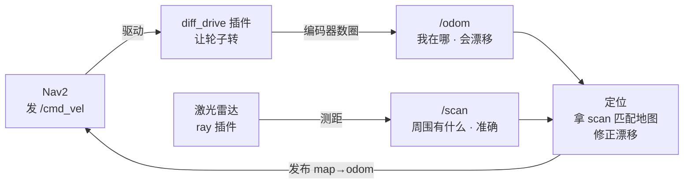
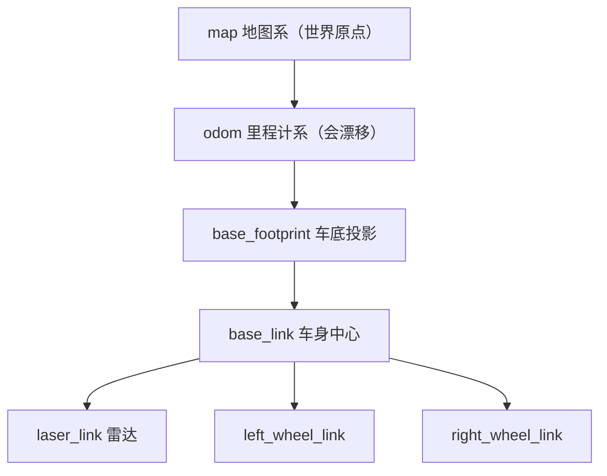

# navbot 项目知识概念全解

> **定位**：本项目的「知识地基」——把所有概念按**从基础到进阶、从感知到决策**的脉络串成一条线。
> **目标**：看完这份文档，你能解释项目里每一个术语、每一个文件、每一条命令背后的"为什么"。
> **用法**：顺着章节读（每章依赖上一章）；也可当词典，遇到不懂的概念直接跳查。
>
> ✅ 填充进度：**全文完成**（第 0~7 章 + 附录）。

---

## 第 0 章 · 项目全景 ✅

> 目标：5 分钟建立大局观，知道「整台车是怎么跑起来的」。后面每一章，都是这个闭环里的某一段放大。

### 0.1 这个项目到底在做什么

**一句话**：做一台两轮差速小车，让它能在陌生环境里「自己建地图 + 自己导航到目标点」。

| 能力 | 靠什么 |
|---|---|
| 感知环境 | 激光雷达 → `/scan` |
| 知道自己在哪 | 编码器 → `/odom`（粗略）+ 激光匹配地图（精确） |
| 自己规划行走 | Nav2（定位 + 代价地图 + 路径规划） |

硬件三样：两个带编码器的轮子 + 一个激光雷达（RPLIDAR A1）+ 一块 STM32 底盘板。

### 0.2 数据流闭环（★ 全项目最重要的一张图）

整个项目是一个**闭环**，数据一直转圈：



**跟着数据走一圈**：

1. Nav2 说「往前 0.2 m/s」→ 发 `/cmd_vel`
2. diff_drive 插件收到 → 转轮子
3. 轮子编码器数圈 → 报 `/odom`（会漂移）
4. 激光雷达转一圈 → 报 `/scan`（准确的墙距）
5. slam_toolbox（建图时）或 AMCL（导航时）拿 `/scan` 匹配地图，**修正掉 odom 的漂移**，发布 `map→odom` 变换
6. Nav2 有了准确位置，重新规划，回到第 1 步

**两个阶段，二选一（绝不能同时开）**：

| 阶段 | 谁发布 map→odom | 干什么 |
|---|---|---|
| 建图 | `slam_toolbox` | 边逛边画地图 |
| 导航 | `AMCL` | 加载地图 + 定位 + 规划路径 |

为什么不能同时开？两个节点抢着发布 `map→odom` 变换，TF 树会抖，车的位置乱跳——这是本项目最高频的「看起来对但不对」的故障。

### 0.3 三个包的分工

| 包 | 层 | 职责 |
|---|---|---|
| `navbot_description` | 模型描述层 | 车长什么样 |
| `navbot_bringup` | 启动配置层 | 怎么把车跑起来 |
| `navbot_bridge` | 桥接层（真机） | 串口 ↔ 话题 |

详见 `A4_三包架构说明.md`，这里不重复。

**本章检查点**：能不看图说出「Nav2 发指令 → 轮子转 → 编码器报位置 → 激光看环境 → 定位修正 → 再发指令」这个闭环，就算过关。

---

## 第 1 章 · 机器人建模（车长什么样）✅

> 目标：搞懂 URDF / Xacro / TF 三件事，能看懂并修改 `navbot.xacro`。

### 1.1 URDF：link 与 joint

**一句话**：URDF 用「连杆 link + 关节 joint」描述机器人——link 是刚性部件，joint 定义部件之间怎么连、能不能动。

**两个核心概念**：

| 概念 | 含义 | 本项目例子 |
|---|---|---|
| link 连杆 | 刚性部件（不变形的实体） | base_link（底盘）、left_wheel_link（左轮）、laser_link（雷达） |
| joint 关节 | 连接两个 link，定义相对运动 | base_joint（固定）、left_wheel_joint（轮子转） |

link 通过 joint 串成一棵**树**（有唯一根，不能成环）。

**joint 的 4 种类型**：

| 类型 | 运动 | 本项目用到 |
|---|---|---|
| `fixed` | 完全固定，不能动 | base_joint、laser_joint、caster_joint |
| `continuous` | 无限旋转（轮子） | left_wheel_joint、right_wheel_joint |
| `revolute` | 有限角度旋转（机械臂） | 没用 |
| `prismatic` | 直线滑动（滑轨） | 没用 |

**joint 关键字段**（看 navbot.xacro 实例）：

```xml
<joint name="base_joint" type="fixed">
    <parent link="base_footprint"/>         <!-- 父连杆 -->
    <child  link="base_link"/>              <!-- 子连杆 -->
    <origin xyz="0 0 0.05" rpy="0 0 0"/>    <!-- 子相对父的位置 -->
</joint>
```

读法：`base_link` 固定在 `base_footprint` 上方 0.05m（xyz 的 z=0.05）。

轮子的 continuous 关节多两个字段：

```xml
<joint name="${prefix}_wheel_joint" type="continuous">
    <parent link="base_link"/>
    <child  link="${prefix}_wheel_link"/>
    <origin xyz="0 ${side*0.16/2} -0.0175" rpy="0 0 0"/>
    <axis xyz="0 1 0"/>                      <!-- 绕 Y 轴转（轮子横躺） -->
    <limit effort="5.0" velocity="20.0"/>    <!-- 力矩/速度上限 -->
</joint>
```

`<axis xyz="0 1 0">` 是关键——轮子默认圆柱轴朝 Z，但轮子要「横躺着滚」，轴得朝 Y，所以视觉几何绕 X 转了 -90°（见 1.3）。

### 1.2 Xacro：宏、include、参数化

**一句话**：Xacro 是 URDF 的「宏处理器」，解决「左右两个轮子代码几乎一样、要写两遍」的重复问题。

**三个能力**：

**① 宏 macro** —— 定义带参数的代码块，可复用：

```xml
<xacro:macro name="wheel" params="prefix side">
    <link name="${prefix}_wheel_link"> ... </link>
    <joint name="${prefix}_wheel_joint" type="continuous"> ... </joint>
</xacro:macro>

<!-- 调两次，生成左右两个轮子 -->
<xacro:wheel prefix="left"  side="1"/>
<xacro:wheel prefix="right" side="-1"/>
```

一个宏 + 两次调用 = 左右轮子，`${prefix}` 会被替换成 left / right。

**② include** —— 把文件拼进另一个文件（`navbot.urdf.xacro`）：

```xml
<xacro:include filename="$(find navbot_description)/urdf/navbot.xacro"/>
<xacro:include filename="$(find navbot_description)/urdf/navbot.gazebo.xacro"/>
```

这就是「总装入口」——它自己不写几何，只负责 include。

**③ 参数化计算** —— `${}` 里能写表达式：

```xml
<origin xyz="0 ${side * 0.16 / 2} -0.0175" .../>
```

`side=1` 时 y=+0.08（左轮），`side=-1` 时 y=-0.08（右轮），一条代码算出两个位置。

### 1.3 惯性 / 视觉 / 碰撞三要素

**一句话**：每个 link 要回答三件事——长什么样（visual）、撞什么形状（collision）、多重怎么转（inertial）。

| 要素 | 作用 | 给谁用 |
|---|---|---|
| `visual` 视觉 | 显示用的几何体 | RViz 渲染、Gazebo 显示 |
| `collision` 碰撞 | 物理碰撞的形状 | Gazebo 物理引擎（撞墙） |
| `inertial` 惯性 | 质量 + 惯性张量 | Gazebo 动力学（车多重、转多费劲） |

看 base_link（navbot.xacro）：

```xml
<link name="base_link">
    <visual>
        <geometry><box size="0.30 0.24 0.06"/></geometry>
    </visual>
    <collision>
        <geometry><box size="0.30 0.24 0.06"/></geometry>
    </collision>
    <xacro:box_inertia m="1.2" x="0.30" y="0.24" z="0.06"/>
</link>
```

惯性张量有现成公式，项目封装成宏：

| 形状 | 宏 | 公式 |
|---|---|---|
| 长方体 | `box_inertia` | Ixx = m(y²+z²)/12 |
| 圆柱 | `cyl_inertia` | Ixx = m(3r²+h²)/12 |
| 球 | `sphere_inertia` | I = 2mr²/5 |

★ 惯性张量不是随便填——填错（没填或全 0）Gazebo 会报「质量为零 / 惯性矩阵无效」，车直接不仿真。

### 1.4 TF 坐标变换

**一句话**：TF 记录「谁相对谁在什么位置」，把所有坐标系串成一棵树，让不同部件的数据能统一理解。

**关键帧（frame）树**：



**两类变换**：

| | tf_static 静态 | tf 动态 |
|---|---|---|
| 对应关节 | fixed（固定） | continuous（转动） |
| 变化 | 永不变化 | 实时更新 |
| 发布频率 | 发一次（记为 10kHz） | 10Hz（本项目） |
| 例子 | base → laser | base → wheel |

这就是你之前 `view_frames` 里 rate 10000 vs 10.2 的来源——静态变换「存死」，动态变换「实时算」。

### 1.5 robot_state_publisher vs joint_state_publisher

**一句话**：`joint_state_publisher` 发「关节转了多少」，`robot_state_publisher` 拿这个 + URDF 算出「坐标系之间的变换」。

| | robot_state_publisher | joint_state_publisher |
|---|---|---|
| 干什么 | 读 URDF → 发 TF | 发关节角度 |
| 输入 | robot_description（URDF）+ /joint_states | robot_description |
| 输出 | /tf_static + /tf | /joint_states |
| C++ / Python | C++ | **Python**（不能 find_package，见踩坑） |

**分工逻辑**：

1. joint_state_publisher 说「左轮转了 0.5 弧度」→ 发 `/joint_states`
2. robot_state_publisher 拿「0.5 弧度」+ URDF 里轮子安装位置 → 算出 `base_link → left_wheel_link` 的 TF

两个配合，RViz 里轮子才会转。这也是 display_navbot.launch.py 里两个节点都要起、且 joint_state_publisher 必须传 robot_description 参数的原因。

**本章检查点**：能说出「link 是啥、joint 四种类型、xacro 宏怎么省代码、TF 树怎么串、rsp 和 jsp 谁发什么」，这一章就过关。

## 第 2 章 · 传感器与感知数据（车怎么感知世界）✅

> 目标：搞懂 /odom 和 /scan 两个最核心话题——它们回答什么、数据从哪来、为什么一个漂移一个不漂移。

### 2.1 里程计 /odom（我在哪、走了多远）

**一句话**：`/odom` 是机器人靠**轮子编码器**自己推算的「我在哪、走了多远」，是**内部估计**，会累积漂移。

**类比**：闭眼走路，靠数步数估算自己走了多远。

| 项 | 说明 |
|---|---|
| 消息类型 | `nav_msgs/msg/Odometry` |
| 数据来源 | 轮子编码器数圈 → 换算出位移和速度 |
| 关键字段 | `pose`（位置+姿态）、`twist`（线速度/角速度）、`frame_id: odom`、`child_frame_id: base_footprint` |
| 谁发的 | 仿真：`diff_drive` 插件；真机：`navbot_bridge` 读编码器 |
| 致命缺点 | 会漂移——轮子打滑、轮径不准、地面不平，误差越积越大 |

**为什么会漂移**（理解这个就理解了导航的核心问题）：

编码器数的是「轮子转了几圈」，但轮子转 ≠ 车真的走了那么远——打滑时轮子空转、车没动。所以 `/odom` 是「轮子以为走了多远」，不是「车真的走了多远」。误差随时间累积，走 100 米可能偏 1 米。

### 2.2 激光扫描 /scan（周围有什么、离我多远）

**一句话**：`/scan` 是激光雷达**实际测到**的「每个方向障碍物离我多远」，是**外部测量**，每次都是真实距离，不累积误差。

**类比**：站房间中央转一圈，每个角度量一下墙离多远，得到一圈距离。

| 项 | 说明 |
|---|---|
| 消息类型 | `sensor_msgs/msg/LaserScan` |
| 数据来源 | 激光打出去 → 打到障碍反弹 → 算飞行时间得距离 |
| 关键字段 | `ranges[]`（每个角度的距离数组）、`angle_min/max`（扫描角度）、`range_min/max`（量程）、`frame_id: laser_link` |
| 谁发的 | 仿真：`ray` 激光插件；真机：`rplidar-ros` 驱动 |

**ranges[] 数组长什么样**：

本项目雷达 360° 采样 360 个点（`samples=360`），`angle_increment = 360°/360 = 1°`。所以 `ranges[0]` 是正前方 0° 的距离，`ranges[90]` 是左方 90° 的距离……数组里 360 个浮点数，每个是该方向的障碍距离（测不到就是 `inf`）。

### 2.3 对比 + 为什么都要

| | /odom | /scan |
|---|---|---|
| 回答 | 我在哪、走了多远 | 周围有什么、离我多远 |
| 性质 | 推算（内部） | 测量（外部） |
| 传感器 | 编码器 | 激光雷达 |
| 误差 | 累积漂移 | 无累积误差 |
| 频率 | 50Hz | 10Hz |

**为什么导航两个都要**：

1. **建图**：把 /scan 的一圈圈激光 + /odom 的位移拼起来，才能拼出完整地图（光有激光不知道车移动了多少）。
2. **定位**：/odom 漂移了，但 /scan 实时看到墙在哪——拿「当前激光」匹配「地图上的墙」，就能**修正 odom 的漂移**。
3. **避障**：规划路径时靠 /scan 实时知道前方障碍，靠定位知道车在哪。

**一句话串起来**：/odom 是车的「自我感觉」，/scan 是车的「眼睛」。自我感觉越来越不准，所以用眼睛看到的墙来校准——这就是 Nav2 定位的底层逻辑。

**落到项目**：两个话题都由 `navbot.gazebo.xacro` 的插件发出——`diff_drive` 发 /odom（`<update_rate>50</update_rate>`），`ray` 激光发 /scan（`<update_rate>10</update_rate>`）。这就是验收 A-5/A-6 里 50Hz 和 10Hz 的来源。

**本章检查点**：能说出 /odom 为什么漂移、/scan 为什么不漂移、导航为什么两个都要。

## 第 3 章 · Gazebo 仿真（虚拟世界）✅

> 目标：搞懂 Gazebo 是什么、插件怎么让车「活」起来、world 和 spawn 是什么。

### 3.1 Gazebo Classic 是什么

**一句话**：Gazebo 是一个**物理仿真器**——在虚拟世界里模拟重力、碰撞、摩擦，让机器人像在真实世界一样运动。

| 项 | 说明 |
|---|---|
| 本项目版本 | Gazebo **Classic 11**（旧版，ROS2 Humble 时代主流） |
| 新版 | Gazebo Ignition/Garden（本项目不用） |
| 为什么用它 | 没硬件也能开发调试，先在仿真跑通再上真机 |

**无头 vs 有界面**：

| 命令 | 作用 |
|---|---|
| `gzserver` | 无界面仿真（物理引擎），容器里用这个 |
| `gzclient` | 图形界面（看车），需要显示器 |
| `gz sim` | 新版 Gazebo 命令，别混用 |

你容器里跑 `gui:=false` 就是只起 gzserver、不起 gzclient。

### 3.2 插件机制（车怎么「活」起来）

**一句话**：URDF 只描述车「长什么样」，Gazebo 插件告诉它「在仿真里怎么动」——插件是 `.so` 动态库，由 Gazebo 加载。

**本项目三个插件**（都在 `navbot.gazebo.xacro`）：

| 插件 | 文件 | 作用 |
|---|---|---|
| diff_drive | `libgazebo_ros_diff_drive.so` | 收 /cmd_vel → 转轮子 → 发 /odom |
| joint_state | `libgazebo_ros_joint_state_publisher.so` | 发 /joint_states（轮子关节角） |
| ray 激光 | `libgazebo_ros_ray_sensor.so` | 发 /scan |

**diff_drive 插件的关键参数**（对应 navbot.gazebo.xacro）：

```xml
<update_rate>50</update_rate>               <!-- 50Hz 更新 -->
<left_joint>left_wheel_joint</left_joint>    <!-- 必须和 URDF 的 joint 名一致 -->
<wheel_separation>0.16</wheel_separation>    <!-- 轮距，和模型一致 -->
<wheel_diameter>0.065</wheel_diameter>       <!-- 轮径 0.0325×2 -->
<publish_odom_tf>true</publish_odom_tf>      <!-- 广播 odom→base_footprint，关键！ -->
```

★ `wheel_separation` / `wheel_diameter` 必须和 URDF 一致，否则里程计算错（车实际走 1m，odom 报 0.9m）。

★ `publish_odom_tf=true` 是 TF 树能闭合的关键——false 的话 odom→base_footprint 断链，Nav2 报「Timed out waiting for transform」。

### 3.3 world 文件与 spawn

**一句话**：world 是「虚拟房间」（地面、墙、障碍），spawn 是把车「放进去」。

**world 文件**（`navbot_room.world`）：描述仿真世界——6m×5m 房间 + 窄通道 + 柱子，由 `sim_navbot.launch.py` 加载。

**spawn**：把机器人模型「生成」到世界某个坐标。sim_navbot.launch.py 里：

```python
spawn_entity_node = TimerAction(
    period=3.0,   # 延迟 3 秒（Gazebo 起得慢）
    actions=[Node(
        package='gazebo_ros', executable='spawn_entity.py',
        arguments=['-topic', 'robot_description', '-entity', 'navbot',
                   '-x', '0', '-y', '0', '-z', '0.05'],  # 抬高避免穿插
    )],
)
```

两个名字要成对：`-entity navbot`（Gazebo 里模型名）和 `-topic robot_description`（机器人描述）。写错会一直「Waiting for entity xml」。

**本章检查点**：能说出 gzserver/gzclient 区别、三个插件各自作用、spawn 为什么延迟 3 秒。

## 第 4 章 · SLAM 建图（画出地图）✅

> 目标：搞懂 SLAM 是什么、地图长什么样、slam_toolbox 怎么用、怎么存图。

### 4.1 SLAM 是什么

**一句话**：SLAM（Simultaneous Localization And Mapping，同时定位与建图）= 边逛边画地图，同时估算自己在哪。

**为什么难**（鸡生蛋问题）：

- 要建地图，得知道自己在哪（否则激光拼不到一起）
- 要知道自己在哪，得先有地图（否则没法对照）

SLAM 解法：**同时**估计位置和地图，用激光匹配来闭环修正。车走一圈，边记录激光、边估算位移，最后拼出一张自洽的地图。

### 4.2 地图 OccupancyGrid（概率占用栅格）

**一句话**：地图是一张「栅格图」，每个格子存一个概率——这格是障碍、空地、还是未知。

| 栅格值 | 含义 | 显示颜色 |
|---|---|---|
| 0（free） | 确认空地，可走 | 白 |
| 100（occupied） | 确认障碍 | 黑 |
| -1（unknown） | 未知，没扫到 | 灰 |

地图在 ROS 里的消息类型是 `nav_msgs/msg/OccupancyGrid`，话题 `/map`。

地图文件两张：`.pgm`（图像，黑白像素）+ `.yaml`（元数据）。

`.yaml` 关键参数（navbot_room.yaml）：

```yaml
image: navbot_room.pgm
resolution: 0.05        # 米/像素，必须和 slam_toolbox 一致
origin: [-3.5, -3.0, 0] # 地图左下角坐标
negate: 0               # 0=白底黑墙，1=反色
occupied_thresh: 0.65   # >0.65 判为障碍
free_thresh: 0.25       # <0.25 判为空地
```

★ `resolution` 必须和建图时的 resolution 一致，否则地图被缩放，所有距离都错。

### 4.3 slam_toolbox 实战

**一句话**：slam_toolbox 是 ROS2 最常用的 SLAM 库，本项目用它在线异步建图。

**怎么起**（slam_mapping.launch.py 包了一层）：

```bash
ros2 launch navbot_bringup slam_mapping.launch.py use_sim_time:=true
```

它内部 include 了 slam_toolbox 官方的 `online_async_launch.py`，参数来自 `config/slam_toolbox_params.yaml`。

**建图关键点**：

1. 车要**慢**（0.1 m/s 左右），转太快建糊
2. 建图时 slam_toolbox 发布 `map→odom`（导航时换成 AMCL，二选一）
3. 存图前 slam_toolbox 必须**还活着**（否则 /map 没数据可存）

### 4.4 map_saver 存图

**一句话**：`map_saver_cli` 把当前 /map 话题存成 .pgm + .yaml 两个文件。

```bash
ros2 run nav2_map_server map_saver_cli -f navbot_room
# 生成 navbot_room.pgm + navbot_room.yaml
```

★ 常见坑：报「Failed to save the map: Map not received」——因为 slam_toolbox 已退出，或 /map 还没发第一帧。先 `ros2 topic hz /map` 确认有数据（约 0.2Hz，5 秒一帧）再存。

**本章检查点**：能说出 SLAM 的鸡生蛋问题、地图三值含义、resolution 为什么重要、存图前要确认什么。

## 第 5 章 · Nav2 导航（自主行走）✅

> 目标：搞懂 Nav2 的整体架构和每个模块职责——这是项目的灵魂。

### 5.1 Nav2 架构全景

**一句话**：Nav2 是 ROS2 的导航框架，把「定位 + 地图 + 规划 + 控制」串成一条流水线。

**核心模块**：

| 模块 | 作用 | 节点名 |
|---|---|---|
| 定位 | 用激光匹配地图，估算位置 | amcl |
| 代价地图 | 标出哪里能走、哪里不能走 | costmap_2d |
| 全局规划 | 地图上找起点到终点的路 | planner_server |
| 局部控制 | 避开动态障碍，跟着路径走 | controller_server |
| 行为树 | 编排整个导航流程 | bt_navigator |

数据流：目标点 → 全局规划（大方向）→ 局部控制（实时避障）→ 发 /cmd_vel。

### 5.2 AMCL 定位（修正 odom 漂移）

**一句话**：AMCL（自适应蒙特卡洛定位）用「粒子滤波」估算机器人在**已知地图**上的位置，专门修正 odom 的漂移。

**粒子滤波怎么理解**：

- 撒一把「粒子」（假设的位置），比如 1000 个
- 每个粒子代表「车可能在这」
- 拿当前 /scan 去匹配地图，粒子位置和地图越吻合，权重越高
- 不断重采样，粒子逐渐聚拢到真实位置

**AMCL 的职责**：发布 `map→odom` 变换（把里程计漂移修正掉）。这就是第 0 章说的「导航阶段 AMCL 发布 map→odom」。

★ 关键：AMCL 需要**初始位姿估计**——RViz 里点「2D Pose Estimate」给个大概位置，否则粒子满天飞，定位不收敛。

### 5.3 代价地图 costmap（哪里能走）

**一句话**：代价地图把「激光看到的障碍 + 地图上的墙」叠加成「哪里能走哪里不能走」，格子带代价值。

| 代价值 | 含义 |
|---|---|
| 0 | 完全可走 |
| 254（致命） | 障碍，绝对不能走 |
| 中间值 | 离障碍越近代价越高 |

**两层代价地图**：

| 层 | 范围 | 作用 |
|---|---|---|
| 全局代价地图 | 整个地图 | 全局规划用 |
| 局部代价地图 | 车周围一块 | 局部避障用 |

关键参数（nav2_params.yaml 里）：`robot_radius`（车半径，代价地图把车当圆）、`inflation_radius`（膨胀半径，离障碍多远开始算危险）。

### 5.4 路径规划（全局 + 局部）

**一句话**：全局规划找「大方向」，局部控制「实时避障跟着走」。

| | 全局规划 | 局部控制 |
|---|---|---|
| 节点 | planner_server | controller_server |
| 算法 | NavFn（本项目 navfn_planner） | DWB（本项目 dwb_controller） |
| 看多远 | 整个地图 | 车周围 |
| 频率 | 低频（目标变了才重算） | 高频（20Hz） |
| 输出 | 一条路径（点序列） | /cmd_vel（速度指令） |

### 5.5 行为树（导航的「大脑」流程）

**一句话**：行为树是导航的「流程图」，定义「先做什么、失败怎么办」——比如「先定位 → 规划 → 控制，规划失败就重试」。

行为树比「写死 if-else」强在哪：节点可复用、失败可恢复、流程可配置。Nav2 用行为树编排：收到目标 → 计算路径 → 跟踪路径 → 到点，任何一步失败走「恢复」分支（原地转一下再试）。

### 5.6 生命周期 lifecycle（节点怎么被激活）

**一句话**：Nav2 的节点是「有状态」的——要按顺序从「未配置」走到「激活」，不是起来就能用。

状态机：`unconfigured → inactive → active`（中间还有 configuring / cleaningup 等过渡态）。

为什么这么设计：导航节点依赖复杂（要先加载地图、加载参数，才能开始规划）。生命周期保证「一切就绪才激活」。nav_bringup.launch.py 里的 `autostart:=true` 就是让 launch 自动按顺序激活所有节点；设 false 则要手动逐个激活（调试用）。

验收 A-9 就是 `ros2 lifecycle get /controller_server` 看状态是不是 active。

**本章检查点**：能说出 Nav2 的 5 个模块、AMCL 为什么能修正漂移、全局/局部规划区别、生命周期为什么存在。

## 第 6 章 · 真机桥接（串口 + 运动学）✅

> 目标：搞懂真机怎么替代仿真——串口通信、差速运动学、协议帧设计。

### 6.1 串口通信与 pyserial

**一句话**：真机没有 Gazebo 帮你发 /odom，得自己写节点读 STM32 底盘发来的串口数据。

| 项 | 说明 |
|---|---|
| 串口 | 车和电脑之间的物理连接（USB 转串口） |
| pyserial | Python 的串口库，读/写串口数据 |
| 波特率 | 115200（本项目） |

桥接节点（`navbot_bridge`）要做的事：读串口 → 解析协议帧 → 发 /odom 和 TF；收 /cmd_vel → 算差速 → 发串口给底盘。

★ pyserial 必须用 apt 的 `python3-serial`（不能用 pip），这是之前踩过的坑。

### 6.2 差速运动学（正解、逆解）

**一句话**：差速小车靠「左右轮速度差」转向——两轮同速直走，速度不同就转弯。

**正解（轮速 → 车速）**：已知左右轮速度，算车的前进速度和角速度：

```
线速度 v = (v_left + v_right) / 2
角速度 ω = (v_right - v_left) / wheel_separation
```

**逆解（车速 → 轮速）**：已知要前进多少、转多少，反推左右轮各转多快（cmd_vel_relay 用）：

```
v_left  = v - ω·L/2
v_right = v + ω·L/2    （L = 轮距）
```

★ 这是真机桥接的核心——/cmd_vel 是「车速」，底盘要的是「左右轮速」，得换算。

### 6.3 协议帧设计（11 字段）

**一句话**：PC 和底盘之间要约定「数据怎么打包」，本项目用逗号分隔的 11 字段帧。

上行帧（底盘 → PC，50Hz）：

```
O,seq,enc_l,enc_r,vel_l,vel_r,pwm_l,pwm_r,vbat,tick,temp
```

| 字段 | 含义 |
|---|---|
| O | 帧头，标识「这是里程计上行帧」 |
| seq | 序号（丢帧检测：序号不连续 = 丢帧） |
| enc_l / enc_r | 左右轮编码器累计值 |
| vel_l / vel_r | 左右轮速度 |
| pwm | PWM 占空比 |
| vbat | 电池电压 |
| tick | 时间戳 |
| temp | 温度 |

下行帧（PC → 底盘）：`V,vel_l,vel_r,...`（V 开头，速度指令）。

★ 为什么用整数 mm/s 而不是浮点 m/s？——串口传整数更省、更可靠，避免浮点精度问题。

**本章检查点**：能说出串口桥接要做什么、差速正解逆解公式、协议帧为什么要 seq 和整数。

## 第 7 章 · 工程化（把项目做扎实）✅

> 目标：搞懂为什么拆三个包、仿真真机怎么切换、环境踩坑怎么防。

### 7.1 三包分层架构

**一句话**：拆三个包是为了「改一处只重编一个包」，职责分离。

| 包 | 层 | 职责 |
|---|---|---|
| navbot_description | 模型描述层 | 车长什么样 |
| navbot_bringup | 启动配置层 | 怎么跑起来 |
| navbot_bridge | 桥接层 | 串口 ↔ 话题 |

依赖单向：bringup → description。完整见 A4_三包架构说明.md。

### 7.2 仿真 vs 真机的场景切换

**一句话**：同一套模型，仿真加载 gazebo 插件、真机走串口桥接，二选一。

| | 仿真 | 真机 |
|---|---|---|
| 谁发 /odom | diff_drive 插件 | bridge 节点读编码器 |
| 谁发 /scan | ray 激光插件 | rplidar 驱动 |
| 加载 gazebo.xacro | ✅ | ❌（注释掉 include 第二行） |

这就是 navbot.urdf.xacro「真机注释掉第二行」的由来——关注点分离。

### 7.3 环境配置与踩坑

**一句话**：环境坑都沉淀在 setup_env.sh，一键重建。

核心四个坑（详见 00_环境一键安装文档.md）：

| 坑 | 表现 | 解法 |
|---|---|---|
| python3 版本冲突 | _rclpy_pybind11 / catkin_pkg 找不到 | PATH 强制 3.10 |
| rosdep 镜像 | raw.githubusercontent 超时 | 中科大 index + 清华 yaml |
| gpu_ray 无头失效 | /scan 空 | 改 ray |
| joint_state_publisher 等 robot_description | 一直 Waiting | 传参数 |

**本章检查点**：能说出拆包理由、仿真真机差异、四个环境坑。

## 附录 ✅

### 附录 A · 核心概念速查表（一页纸串起全部）

| 概念 | 一句话 |
|---|---|
| link / joint | 刚性部件 / 连接关系 |
| TF | 坐标系变换树 |
| /odom | 里程计，内部推算，会漂移 |
| /scan | 激光测距，外部测量，准确 |
| /map | 概率占用栅格地图 |
| /cmd_vel | 速度指令（线速度 + 角速度） |
| diff_drive 插件 | 仿真里驱动轮子、发 odom |
| slam_toolbox | 建图（发布 map→odom） |
| AMCL | 定位（发布 map→odom，修正漂移） |
| 代价地图 | 哪里能走哪里不能走 |
| 全局 / 局部规划 | 大方向 / 实时避障 |
| 行为树 | 导航流程编排 |
| 生命周期 | 节点激活状态机 |
| 差速逆解 | /cmd_vel → 左右轮速 |

### 附录 B · 面试口述清单

1. **项目做什么**：两轮差速小车，slam_toolbox 建图 + Nav2 导航
2. **三个包怎么分**：描述 / 启动 / 桥接，职责分离
3. **map→odom 谁发布**：建图 slam_toolbox、导航 AMCL，二选一
4. **/odom 为什么漂移**：编码器数圈，打滑不感知
5. **怎么修正漂移**：/scan 匹配地图（AMCL 粒子滤波）
6. **仿真真机怎么复用**：同模型，gazebo 插件 vs 串口桥接
7. **环境最难坑**：python3 版本冲突、无头 gpu_ray

---

> ✅ 全文完成。第 0~7 章 + 附录已全部填充，每章遵循「一句话结论 → 拆开讲 → 表格/图 → 落到本项目文件」的套路。
